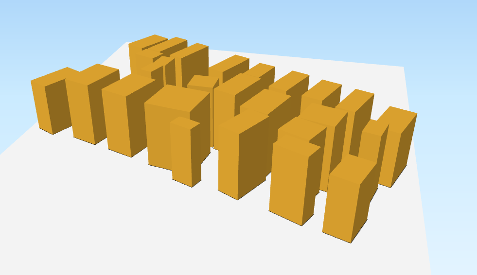

# Pattern Search Exploration method on SimPLU Model

## Content of this branch 

+ This readme file that provides an introduction on PSE exploration applied to SimPLU 
+ R scripts to analyze results of PSE method
+ Instructions to batch-generate shapefiles corresponding to some results' configurations  
+ Some results 

## PSE Method 
Pattern Search Exploration (PSE) is an open-ended evolutionary method of the OpenMOLE frameWork, designed to explore the diversity of simulation models outputs. See the article [here](http://journals.plos.org/plosone/article?id=10.1371/journal.pone.0138212)

Whereas optimization techniques focus on discovering (near)optimal solutions from a set of feasible solutions, PSE aims at exhibiting the diversity of patterns a model can produce.
This is done by cleverly selecting the parameters that produce patterns that are as different one to each other as possible.
The massive amounts of simulation runs that PSE requires is made possible by framing the model into the OpenMOLE platform. (See the master branch of this repository)

In other words, PSE make a **clever sampling of the pattern space of a simulation model**.

##Application to SimPLU

SimPLU aims at simulating buildings morphologies w.r.t. formalized urbanistic rules of construction.
Most of these rules are *parametric* e.g. "you shall not build your house within 2 meters of the road" . 

These parameters have a direct influence on the shape of possible buildings as the rules affect their volumes, heights etc. They are defined at the scale of a *parcel*.

The idea of a PSE framework applied on SimPLU is to explore the diversity of building configurations at the scale of a *zone* (i.e. several contiguous parcels)

## The SimPLU model

The project is described and available [here](https://github.com/IGNF/simplu3D)

For the sake of this particular exploration case, we will abstract SimPLU as a machine that transforms inputs parameters into outputs measure.

The inputs under study are the parameters of the rules constituting urban regulation document (Plan Local d'Urbanisme a.k.a. PLU)
The other inputs (the set of rules at play, the zone where the simulation is performed,etc.) are kept constant.

The outputs under study are global measures (i.e. at the scale of the zone) of the morphology of generated buildings and their distribution on the zone. 
Other outputs are dimensions and coordinates of the cubes constituting the buildings in the simulated the zone. We use them later for visualization of some of the configurations discovered by PSE.

## Input space

In this experiments, the input space is constituted of 7 parameters:

+ distReculVoirie: the distance between buildings of a parcel and the road (street)
+ distReculFond: the distance between buildings of a parcel and the bottom of the parcel
+ distReculLat: the distance between buildings of a parcel and the sides of the parcel   
+ maximalCES: the maximal surface ratio  between buildings surface and parcel surface  
+ hIniRoad : the height of the wall facing the road (see figure below)
+ slopeRoad : the angle of the line between the top of the roof and the plane at hIniRoad (see figure below)
+ hauteurMax : the maximal height of the building

An other implicit input is the seed used for the random number generator of SimPLU.

## Output space 

### Desired properties of measures

Various measures are available to qualify the output of a simulation run; PSE method accepts any kind of measures (discrete or continuous). The ideal measures for PSE should be : 

+ discriminative regarding the possible output patterns (we are looking for variety) ;
+ as independent as possible of each other ;
+ easily interpretable  ;
+ sound regarding the thematic domain (here, a mix between urbanism and soil occupation).
 

### Current available measures

+ Gini index ; inequality in buildings' volume distribution
+ Moran's I :  spatial autocorrelation of volume among parcels of the zone
+ Number of box : number of boxes constituting buildings , a rough proxy towards configuration visual complexity
+ Coverage ratio : built surface ratio  (built surface / total surface)
+ Floor density : like traditional density but taking surface of additional floors of buildings into account
+ Moran's profile  I : *ad hoc* measure based on repartition of heights of buildings along the road that delineates the zone. 
+ Energy: a quantity homogeneous to volume of the building

Moran's I has variants depending on the interaction term between two parcels : current version features euclidean distance between parcel centroids, but one could also imagine alternatives where the distance is taken from building centroids to centroid of the zone, or distance as a number of adjacent neighbors. 

### Other measures (to be included later)(maybe)(we'll see)

+ entropy 
+ porosity (seems hard to implement correctly though) from [Luc Adolphe's work](http://epb.sagepub.com/content/28/2/183.short) 
+ rugosity (Ibid.)

##What it looks like

##Other useful stuff 
### data Format / meta data

####Energy file 
The energy file is a `.csv` file produced by one execution of Simplu.
It contains several columns : inputparameters first , measures next
All are made of type double values if not precised otherwise

Input parameters
+ distReculVoirie
+ distReculFond 
+ distReculLat 
+ maximalCES 
+ hIniRoad 
+ slopeRoad 
+ hauteurMax 
+ seed (long) to initialize the RNG of simplu
 

Ouputs 
 + energy
 + coverageRatio
 + gini
 + moran 
 + entropy (currently NaN)
 + boxCount
 + maxHeight
 + densite
 + moranProfile

#### PSE results file 
Usually named populatioXXXXX.csv with XXXX the number of the PSE method iterations.

The format differs a little from the Simplu results files.

First column `evolution$generation` is useless for analysis purpose, as it just contains the current iteration number of the method.

Each line of the PSE results file contains some input parameters and output measures. 
Output measures are in fact the median values of several (e.g.100) replication of model (simPLU) executions.  
Last column `evolution$sample` contains the number of executions that has been performed to produce the output measures (median) values. 

Input parameters
+ distReculVoirie
+ distReculFond 
+ distReculLat 
+ maximalCES 
+ hIniRoad 
+ slopeRoad 
+ hauteurMax 
+ seed (long) to initialize the RNG of simplu
 
Output measures (3-4 in general)
e.g. 
 + energy
 + coverageRatio
 + gini
 + moran 

